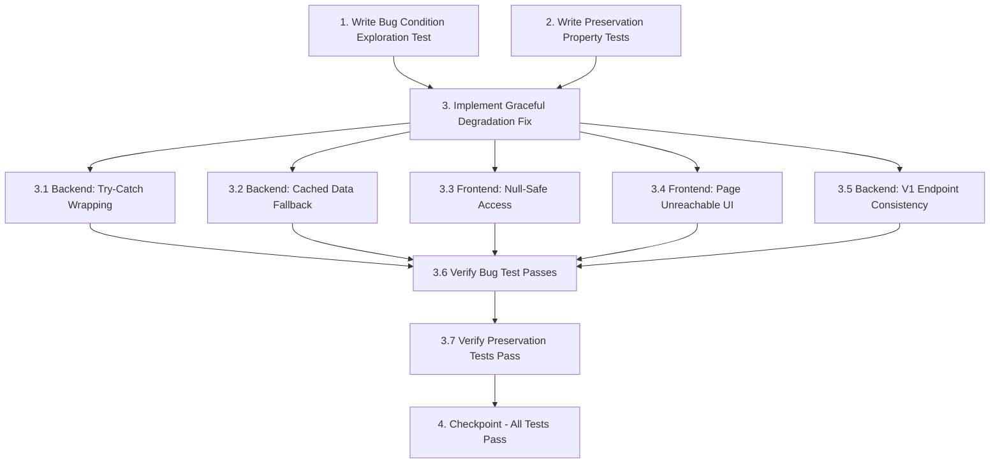

# Implementation Plan

## Overview

This implementation plan follows the bugfix exploratory workflow using the bug condition methodology. The tasks are ordered to:
1. **Explore first** - Write a property-based test that demonstrates the bug on unfixed code (expected to fail)
2. **Preserve baseline** - Write property-based tests that capture current behavior for non-buggy scenarios (expected to pass on unfixed code)
3. **Implement fix** - Add graceful degradation with try-catch blocks, cached data fallback, and null-safe UI
4. **Validate** - Re-run exploration test (should now pass) and preservation tests (should still pass)

The fix addresses backend scraper crashes when Academia pages return 404/401 errors and frontend crashes on null data access.

## Tasks

- [x] 1. Write bug condition exploration test
  - **Property 1: Bug Condition** - Academia Page Unavailability Crashes System
  - **CRITICAL**: This test MUST FAIL on unfixed code - failure confirms the bug exists
  - **DO NOT attempt to fix the test or the code when it fails**
  - **NOTE**: This test encodes the expected behavior - it will validate the fix when it passes after implementation
  - **GOAL**: Surface counterexamples that demonstrate the bug exists
  - **Scoped PBT Approach**: For deterministic bugs, scope the property to the concrete failing case(s) to ensure reproducibility
  - Test implementation details from Bug Condition in design:
    - Mock Academia pages to return HTTP 404/401 status codes
    - Run scraper against mocked responses with `isBugCondition(input)` where `(input.httpStatusCode IN [404, 401] OR input.scrapingResult.profileData == null)`
    - Assert the system should NOT crash and should return partial data structure
    - Pass null profileData to frontend components
    - Assert frontend should NOT throw "Cannot read properties of null" exceptions
  - The test assertions should match the Expected Behavior Properties from design:
    - Backend returns partial data structure with error flags
    - Backend attempts cached data retrieval
    - Frontend displays "Page unreachable" messages
    - No unhandled exceptions occur
  - Run test on UNFIXED code
  - **EXPECTED OUTCOME**: Test FAILS (this is correct - it proves the bug exists)
  - Document counterexamples found to understand root cause:
    - Scraper throws unhandled exceptions when pages return 404/401
    - Frontend throws "Cannot read properties of null (reading 'name')" 
    - No fallback to cached data occurs
  - Mark task complete when test is written, run, and failure is documented
  - _Requirements: 1.1, 1.2, 1.3, 1.4_

- [ ] 2. Write preservation property tests (BEFORE implementing fix)
  - **Property 2: Preservation** - Successful Scraping Behavior Unchanged
  - **IMPORTANT**: Follow observation-first methodology
  - Observe behavior on UNFIXED code for non-buggy inputs (all pages return HTTP 200, valid DOM elements present)
  - Observe: When all Academia pages are available, scraper successfully extracts profileData, attendanceData, marksData, and timetableHTML
  - Observe: Frontend displays all sections normally without error messages
  - Observe: SSE progress events are emitted during scraping
  - Observe: Database caching upsert occurs after successful scraping
  - Write property-based tests capturing observed behavior patterns from Preservation Requirements:
    - **PBT Generator**: Generate random valid profile data (name, registrationNo, programmeBranch, schoolDepartment, section, semester)
    - **PBT Generator**: Generate random valid attendance data with attendance percentages and course details
    - **PBT Generator**: Generate random valid marks data with component scores
    - **PBT Generator**: Generate random valid timetable HTML structures
    - **Property Assertion**: For all generated valid inputs, scraper_fixed returns same structure as scraper_original
    - **Property Assertion**: For all valid complete data, frontend_fixed renders same output as frontend_original
    - **Property Assertion**: For all successful scraping scenarios, SSE events match original sequence
    - **Property Assertion**: For all successful scraping scenarios, database records match original format
  - Property-based testing generates many test cases for stronger guarantees
  - Run tests on UNFIXED code
  - **EXPECTED OUTCOME**: Tests PASS (this confirms baseline behavior to preserve)
  - Mark task complete when tests are written, run, and passing on unfixed code
  - _Requirements: 3.1, 3.2, 3.3, 3.4, 3.5_

- [ ] 3. Implement graceful degradation fix

  - [ ] 3.1 Backend: Wrap individual page scraping in try-catch blocks
    - **File**: `unfugly-backend/scraper.js` - `router.post('/all', verifyJWT, async (req, res) => {...})`
    - Wrap profile page scraping (lines ~202-215) in try-catch:
      ```javascript
      try {
        await playPage.goto('https://academia.srmist.edu.in/#Page:My_Time_Table_2023_24');
        scrapedData.profileData = await extractProfileData(playPage);
      } catch (error) {
        logger.error('Profile page unavailable', error);
        scrapedData.profileData = null;
        scrapedData.errors.profile = `Profile page unavailable (${error.message})`;
      }
      ```
    - Wrap attendance/marks scraping (lines ~217-227) in try-catch, preserve profile data on failure
    - Wrap timetable scraping (lines ~229-246) in try-catch, preserve previously scraped sections on failure
    - Add errors object to scrapedData structure:
      ```javascript
      const scrapedData = {
        profileData: null,
        attendanceData: null,
        marksData: null,
        timetableHTML: null,
        courseSlotMap: null,
        batch: null,
        errors: {
          profile: null,
          attendance: null,
          marks: null,
          timetable: null
        }
      };
      ```
    - Do NOT close browser on first page failure - continue attempting remaining pages
    - _Bug_Condition: isBugCondition(input) where (input.httpStatusCode IN [404, 401] OR input.scrapingResult.profileData == null)_
    - _Expected_Behavior: Backend returns partial data structure with error flags, attempts cached data retrieval, no unhandled exceptions_
    - _Preservation: Successful scraping continues to work exactly as before (Requirements 3.1, 3.2, 3.3, 3.5)_
    - _Requirements: 2.1, 2.2, 2.3, 2.5_

  - [ ] 3.2 Backend: Implement cached data fallback logic
    - **File**: `unfugly-backend/scraper.js`
    - After scraping failures, query database for cached data:
      ```javascript
      if (scrapedData.profileData === null) {
        const cachedProfile = await db.query(
          'SELECT name, registration_no, programme_branch, school_department, section, semester FROM users WHERE net_id = ?',
          [net_id]
        );
        if (cachedProfile.length > 0) {
          scrapedData.profileData = cachedProfile[0];
          scrapedData.errors.profile = 'Using cached profile data (fresh scraping failed)';
        }
      }
      ```
    - Query `user_logs` table for attendance, marks, and timetable data when respective scraping fails
    - Merge cached data with successfully scraped sections, preferring fresh data when available
    - Update SSE progress events to indicate cached data usage:
      ```javascript
      emitProgress(net_id, 'profile', 'Profile page unavailable - using cached data');
      ```
    - _Bug_Condition: When scraping fails and cachedDataExists == true_
    - _Expected_Behavior: Backend returns cached data with flag indicating stale data_
    - _Preservation: Fresh scraping still preferred when available (Requirements 3.2, 3.3)_
    - _Requirements: 2.1, 2.2_

  - [x] 3.3 Frontend: Add null-safe property access and error state management
    - **File**: `webapp/src/app/dashboard/page.tsx`
    - Line 71-79: Change null check from `if (cachedData.profileData)` to `if (cachedData?.profileData?.name)` to safely check nested properties
    - Add state for tracking unavailable sections:
      ```typescript
      const [partialErrors, setPartialErrors] = useState<Record<string, string>>({});
      const [showErrorToast, setShowErrorToast] = useState(false);
      ```
    - When receiving scraped data with errors object, update error state:
      ```typescript
      if (scrapedData.errors && Object.keys(scrapedData.errors).filter(k => scrapedData.errors[k]).length > 0) {
        setPartialErrors(scrapedData.errors);
        setShowErrorToast(true);
        setTimeout(() => setShowErrorToast(false), 6000);
      }
      ```
    - Before calling `setData(cachedData)`, validate that at least profile name exists
    - _Bug_Condition: When frontend receives null or undefined profileData_
    - _Expected_Behavior: Frontend checks for null before property access, displays error messages, no crashes_
    - _Preservation: When data is available, frontend continues to render normally (Requirements 3.4)_
    - _Requirements: 2.4, 2.6_

  - [x] 3.4 Frontend: Implement "Page Unreachable" UI components
    - **File**: `webapp/src/components/TimetableView.tsx`
    - Add conditional rendering for null timetable data:
      ```typescript
      {timetableData === null ? (
        <div className="flex flex-col items-center justify-center p-8 text-gray-500">
          <svg className="w-16 h-16 mb-4" /* ... icon ... */></svg>
          <h3 className="text-lg font-semibold mb-2">Timetable Unavailable</h3>
          <p>The timetable page is currently unreachable. Please try again later.</p>
          {partialErrors.timetable && <p className="text-sm mt-2">{partialErrors.timetable}</p>}
        </div>
      ) : (
        /* Render timetable normally */
      )}
      ```
    - **File**: `webapp/src/components/AttendanceView.tsx` (if exists)
    - Add null check before rendering attendance table
    - Display "Attendance data currently unavailable" message with icon when null
    - **File**: `webapp/src/components/MarksView.tsx` (if exists)
    - Add null check before rendering marks table
    - Display "Marks data currently unavailable" message when null
    - **File**: `extension/content.js`
    - Lines 1008-1012: Add null-safe checks before accessing profileData properties using optional chaining
    - _Bug_Condition: When sections are null due to page unavailability_
    - _Expected_Behavior: Display clear "Page unreachable" messages instead of attempting to render null data_
    - _Preservation: Available sections continue to render normally_
    - _Requirements: 2.4, 2.6_

  - [ ] 3.5 Backend: Apply same changes to v1 scrape endpoint
    - **File**: `unfugly-backend/routes/v1/scrape.js`
    - Apply identical try-catch wrapping to `/v1/scrape/all` endpoint
    - Apply identical cached data fallback logic
    - Apply identical partial data structure response format
    - Ensure consistency between main scraper and v1 API endpoint
    - _Preservation: Both endpoints maintain same behavior patterns_
    - _Requirements: 2.1, 2.2, 2.3, 2.5_

  - [ ] 3.6 Verify bug condition exploration test now passes
    - **Property 1: Expected Behavior** - Academia Page Unavailability Handled Gracefully
    - **IMPORTANT**: Re-run the SAME test from task 1 - do NOT write a new test
    - The test from task 1 encodes the expected behavior
    - When this test passes, it confirms the expected behavior is satisfied
    - Run bug condition exploration test from step 1 against fixed code
    - Verify assertions pass:
      - Backend returns partial data structure with error flags (no crashes)
      - Backend attempts cached data retrieval when available
      - Frontend displays "Page unreachable" messages (no crashes)
      - No unhandled "Cannot read properties of null" exceptions
    - **EXPECTED OUTCOME**: Test PASSES (confirms bug is fixed)
    - _Requirements: 2.1, 2.2, 2.3, 2.4, 2.5, 2.6_

  - [ ] 3.7 Verify preservation tests still pass
    - **Property 2: Preservation** - Successful Scraping Behavior Unchanged
    - **IMPORTANT**: Re-run the SAME tests from task 2 - do NOT write new tests
    - Run preservation property tests from step 2 against fixed code
    - Verify all generated test cases still pass:
      - For all valid inputs, scraper produces same structure as before
      - For all complete data, frontend renders same output as before
      - SSE events match original sequence
      - Database records match original format
    - **EXPECTED OUTCOME**: Tests PASS (confirms no regressions)
    - Confirm all tests still pass after fix - no behavior changed for successful scraping scenarios
    - _Requirements: 3.1, 3.2, 3.3, 3.4, 3.5_

- [x] 4. Checkpoint - Ensure all tests pass
  - Run bug condition exploration test - should now PASS
  - Run preservation property tests - should still PASS
  - Run any existing unit tests for scraper and frontend components
  - Manually test scenarios:
    - New user during off-semester (all pages unavailable, no cache)
    - Existing user with cache (pages unavailable, should see cached data)
    - Partial availability (some pages work, others don't)
    - Normal operation (all pages available) - should be unchanged
  - Ask user if questions arise or if additional testing is needed


## Task Dependency Graph



```json
{
  "waves": [
    {
      "name": "Wave 1: Test Writing",
      "tasks": ["1", "2"],
      "description": "Write exploration test (will fail on unfixed code) and preservation tests (will pass on unfixed code)"
    },
    {
      "name": "Wave 2: Backend Fixes",
      "tasks": ["3.1", "3.2", "3.5"],
      "description": "Implement backend graceful degradation with try-catch, cached data fallback, and v1 endpoint consistency"
    },
    {
      "name": "Wave 3: Frontend Fixes",
      "tasks": ["3.3", "3.4"],
      "description": "Implement frontend null-safe access and Page Unreachable UI components"
    },
    {
      "name": "Wave 4: Validation",
      "tasks": ["3.6", "3.7"],
      "description": "Verify exploration test now passes and preservation tests still pass"
    },
    {
      "name": "Wave 5: Final Checkpoint",
      "tasks": ["4"],
      "description": "Run all tests and perform manual testing"
    }
  ]
}
```

**Critical Path**: 1 → 3.1-3.5 → 3.6 → 3.7 → 4

**Parallelizable**: Tasks 1 and 2 can be done in parallel. Tasks 3.1-3.5 can be done in parallel after tasks 1-2 complete.

## Notes

### Testing Philosophy

- **Exploration tests MUST fail on unfixed code** - This confirms the bug exists and validates our understanding
- **Preservation tests MUST pass on unfixed code** - This captures baseline behavior to preserve
- After implementation, exploration tests should pass and preservation tests should still pass

### Property-Based Testing

Both exploration and preservation tests use property-based testing to:
- Generate many test cases automatically across the input domain
- Catch edge cases that manual unit tests might miss
- Provide stronger guarantees about correctness and preservation

### Backend Implementation Priority

Focus on getting the backend fixes (3.1-3.2) working first, as they enable the frontend fixes (3.3-3.4) to be tested properly. The v1 endpoint (3.5) can be done in parallel or after the main scraper is fixed.

### Frontend Components

Some frontend files mentioned (AttendanceView.tsx, MarksView.tsx) may not exist yet. If they don't exist, verify the actual component names and file locations in the webapp directory structure before implementing task 3.4.
