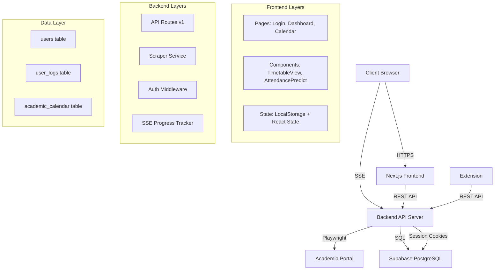
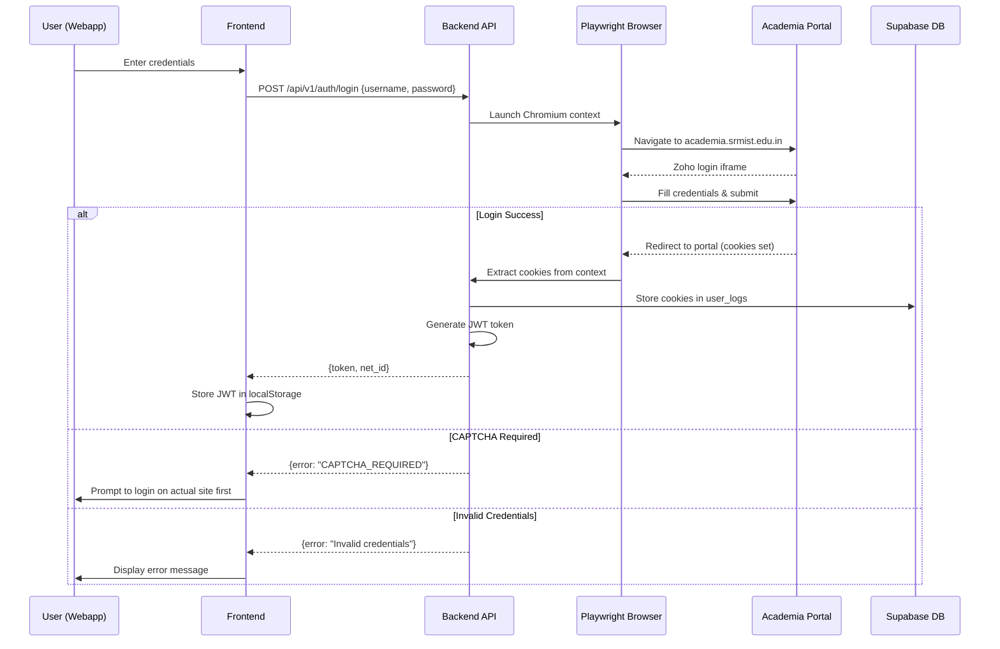
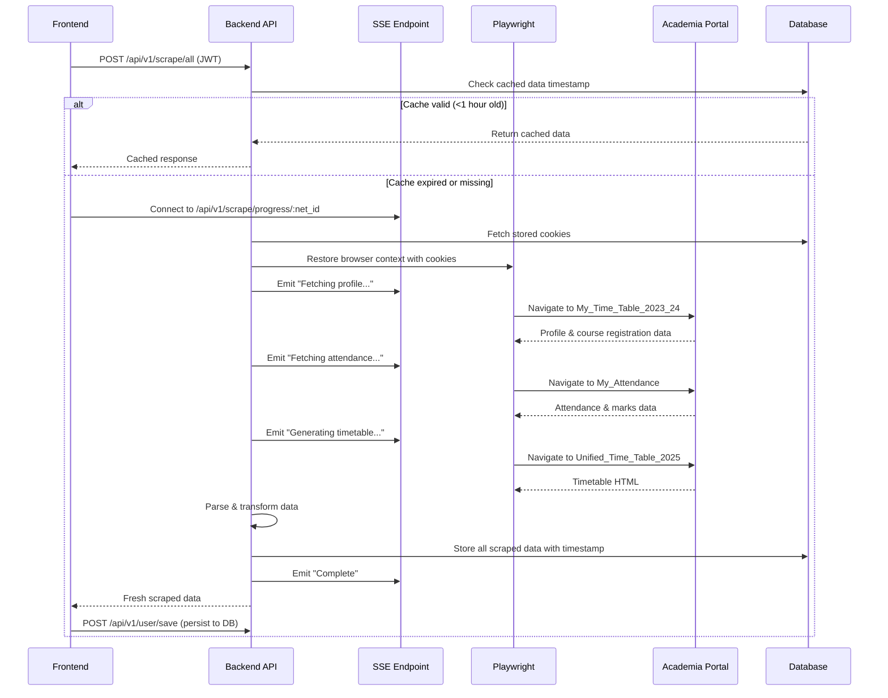

# Design Document: Webapp Enhancements

## Overview

This design document specifies the technical architecture and implementation details for transforming the Unfugly browser extension into a full-featured webapp. The system maintains feature parity with the existing extension while adding mobile responsiveness and automated feedback submission as a unique selling point.

### Core Objectives

1. **Authentication Architecture**: Implement backend proxy with HttpOnly cookie management
2. **Data Management**: Build caching layer with 1-hour TTL and Server-Sent Events for progress tracking
3. **UI Parity**: Achieve pixel-perfect desktop UI matching the extension
4. **Mobile Optimization**: Create responsive mobile experience with bottom navigation
5. **Automation Feature**: Implement feedback filler as webapp's unique selling proposition
6. **Calendar Reliability**: Ensure accurate day order calculation and display

### Technology Stack

**Frontend:**
- Framework: Next.js 14+ (App Router)
- UI Library: React 18+
- Styling: Tailwind CSS + Custom CSS
- State Management: React Hooks (useState, useEffect)
- HTTP Client: Fetch API with Server-Sent Events

**Backend:**
- Runtime: Node.js with Express.js
- Browser Automation: Playwright (Chromium)
- Database: Supabase (PostgreSQL)
- Authentication: JWT tokens
- Rate Limiting: express-rate-limit

**Existing Implementation:**
- Extension: Vanilla JavaScript with Chrome Extension APIs
- CAPTCHA Solver: Go-based Tesseract OCR service

## Architecture

### High-Level System Architecture



### Authentication Flow



### Data Scraping & Caching Flow



## Components and Interfaces

### Frontend Components

#### 1. Authentication Component (`/login/page.tsx`)

**Purpose**: Handle user login and session initialization

**Props**: None (Page component)

**State:**
```typescript
{
  username: string;
  password: string;
  loading: boolean;
  error: string | null;
}
```

**Key Methods:**
- `handleLogin()`: Submit credentials to backend, store JWT token
- `validateInput()`: Client-side validation for empty fields

**API Interactions:**
- POST `/api/v1/auth/login` - Authenticate user
- Response: `{ token: string, net_id: string }`

#### 2. Dashboard Component (`/dashboard/page.tsx`)

**Purpose**: Main application hub displaying all academic data

**Props**: None (Page component)

**State:**
```typescript
{
  activeTab: 'Timetable' | 'Attendance' | 'Marks' | 'Calendar';
  loading: boolean;
  isBgScraping: boolean;
  data: {
    profileData: ProfileData;
    attendanceData: AttendanceItem[];
    marksData: MarksItem[];
    timetableHTML: string;
    timetableJSON: TimetableJSON;
    courseData: CourseSlotMap;
    editedSlots: EditedSlotsMap;
  };
  calendarData: CalendarData;
  progressMsg: string;
}
```

**Key Methods:**
- `startScraping(token, net_id, isBackground)`: Initiate data scraping with SSE progress
- `handleLogout()`: Clear localStorage and redirect
- `useEffect()`: Initial data fetch and calendar load

**API Interactions:**
- GET `/api/v1/user/data` - Fetch cached data
- POST `/api/v1/scrape/all` - Trigger fresh scrape
- SSE `/api/v1/scrape/progress/:net_id` - Progress updates
- POST `/api/v1/user/save` - Persist scraped data
- GET `/api/v1/calendar` - Fetch calendar data

#### 3. TimetableView Component (`/components/TimetableView.tsx`)

**Purpose**: Render timetable with edit functionality for desktop and mobile

**Props:**
```typescript
{
  htmlContent: string;
  courseData: CourseSlotMap;
  netId: string;
  calendarData: CalendarData;
  timetableJSON: TimetableJSON;
  profileData: ProfileData;
  dbEditedSlots: EditedSlotsMap;
}
```

**State:**
```typescript
{
  isEditMode: boolean;
  viewState: 'hide' | 'show' | 'modify';
  parsedData: TimetableJSON;
  mobileDayIndex: number;
  editedSlots: Record<string, { title: string; classroom: string }>;
}
```

**Key Methods:**
- `parseTableToJSON(table)`: Convert HTML table to JSON structure
- `getDayOrderForDate(date, calendarData)`: Calculate day order for date
- `handleSlotClick(slotId, defaultTitle, defaultRoom)`: Edit slot via prompt
- `removeEdit(e, slotId)`: Remove user edit and restore original
- `downloadTimetable()`: Generate PNG using html2canvas
- `renderDesktopTable()`: Render full week table view
- `renderMobileTable()`: Render single-day card view

**API Interactions:**
- PUT `/api/v1/user/slots` - Save edited slots to backend

#### 4. AttendancePredict Component (`/components/AttendancePredict.tsx`)

**Purpose**: Calculate projected attendance for date ranges

**Props:**
```typescript
{
  attendanceData: AttendanceItem[];
  courseData: CourseSlotMap;
}
```

**State:**
```typescript
{
  isOpen: boolean;
  calendarData: CalendarData;
  fromDate: Date;
  toDate: Date;
  projectedAttendance: ProjectedAttendanceMap;
  loading: boolean;
}
```

**Key Methods:**
- `calculateProjectedAttendance()`: Compute attendance for date range
- `getDayOrderForDate(date)`: Look up day order from calendar
- `countCourseOccurrences(courseCode, fromDate, toDate)`: Count class occurrences

**API Interactions:**
- GET `/api/v1/calendar` - Fetch calendar for calculations

#### 5. Calendar Component (`/calendar/page.tsx`)

**Purpose**: Display academic calendar with day orders

**Props**: None (Page component)

**State:**
```typescript
{
  calendarData: CalendarData;
  currentMonth: number;
  currentYear: number;
  selectedDate: Date | null;
}
```

**Key Methods:**
- `navigateMonth(direction)`: Move to previous/next month
- `getDayOrderForDate(date)`: Retrieve day order for specific date
- `renderCalendarGrid()`: Generate month view with day orders

**API Interactions:**
- GET `/api/v1/calendar` - Fetch calendar data

#### 6. FeedbackFiller Component (`/components/FeedbackFiller.tsx`)

**Purpose**: Automate feedback form submission

**Props:**
```typescript
{
  profileData: ProfileData;
  courseData: CourseSlotMap;
}
```

**State:**
```typescript
{
  isOpen: boolean;
  feedbackPreferences: FeedbackPreferencesMap;
  submissionStatus: SubmissionStatusMap;
  progress: number;
  sameCommentForAll: boolean;
  globalComment: string;
}
```

**Key Methods:**
- `handleSubmit()`: Initiate feedback submission flow
- `submitFeedbackForCourse(courseCode)`: Submit single course feedback
- `applyTemplate(templateName)`: Apply predefined feedback template

**API Interactions:**
- POST `/api/v1/feedback/submit` - Submit feedback form
- POST `/api/v1/feedback/batch` - Submit multiple forms

### Backend API Endpoints

#### Authentication Endpoints

**POST /api/v1/auth/login**
```
Purpose: Authenticate user with Academia credentials
Request Body: {
  username: string,  // Net ID or email
  password: string
}
Response: {
  token: string,     // JWT token (7-day expiry)
  net_id: string,
  message: string
}
Error Responses:
  400: Missing credentials
  401: Invalid credentials
  403: CAPTCHA required
```

**POST /api/v1/auth/logout**
```
Purpose: Invalidate session and close browser context
Headers: Authorization: Bearer <token>
Response: {
  message: string
}
```

**POST /api/v1/auth/login-cookie**
```
Purpose: Alternative login via raw cookie string (for extension migration)
Request Body: {
  net_id: string,
  raw_cookies: string  // TSV format from extension
}
Response: {
  token: string,
  net_id: string
}
```

#### Scraping Endpoints

**POST /api/v1/scrape/all**
```
Purpose: Trigger full data scrape from Academia
Headers: Authorization: Bearer <token>
Response: {
  profileData: ProfileData,
  attendanceData: AttendanceItem[],
  marksData: MarksItem[],
  timetableHTML: string,
  courseSlotMap: CourseSlotMap,
  batch: string
}
Error Responses:
  401: No active session (re-login required)
  500: Scraping failed
```

**GET /api/v1/scrape/progress/:net_id**
```
Purpose: Server-Sent Events stream for scraping progress
Response Stream: text/event-stream
Event Format: {
  step: 'profile' | 'attendance' | 'timetable' | 'complete' | 'error',
  message: string
}
```

#### User Data Endpoints

**GET /api/v1/user/data**
```
Purpose: Fetch cached user data (1-hour TTL)
Headers: Authorization: Bearer <token>
Response: {
  profileData: ProfileData,
  attendanceData: AttendanceItem[],
  marksData: MarksItem[],
  timetableHTML: string,
  timetableJSON: TimetableJSON,
  courseData: CourseSlotMap,
  editedSlots: EditedSlotsMap,
  lastSynced: string (ISO timestamp)
}
```

**POST /api/v1/user/save**
```
Purpose: Persist scraped data to database
Request Body: {
  net_id: string,
  profile_data: ProfileData,
  attendance_json: AttendanceItem[],
  marks_json: MarksItem[],
  timetable_html: string,
  course_slot_map_json: CourseSlotMap,
  source: 'webapp' | 'extension',
  last_updated_ist: string (ISO timestamp)
}
Response: {
  message: string,
  student: string,
  sync_count: number
}
```

**PUT /api/v1/user/slots**
```
Purpose: Update edited timetable slots
Headers: Authorization: Bearer <token>
Request Body: {
  edited_slots_json: EditedSlotsMap
}
Response: {
  message: string
}
```

**GET /api/v1/user/photo**
```
Purpose: Proxy profile photo from Academia using session cookies
Headers: Authorization: Bearer <token>
Response: Image binary (JPEG/PNG)
```

#### Calendar Endpoints

**GET /api/v1/calendar**
```
Purpose: Fetch academic calendar with day orders
Response: {
  [monthKey: string]: {
    [dayKey: string]: {
      dayOrder: string | '-',
      events: string[]
    }
  }
}
```

**POST /api/v1/calendar**
```
Purpose: Update calendar data (admin operation)
Request Body: {
  calendar_json: CalendarData,
  last_updated_ist: string
}
Response: {
  message: string
}
```

#### Feedback Endpoints

**POST /api/v1/feedback/submit**
```
Purpose: Submit single course feedback
Headers: Authorization: Bearer <token>
Request Body: {
  course_code: string,
  ratings: number[],  // Array of 15 ratings (1-5)
  comment: string
}
Response: {
  success: boolean,
  course_code: string
}
```

**POST /api/v1/feedback/batch**
```
Purpose: Submit multiple course feedbacks
Headers: Authorization: Bearer <token>
Request Body: {
  submissions: Array<{
    course_code: string,
    ratings: number[],
    comment: string
  }>
}
Response: {
  results: Array<{
    course_code: string,
    success: boolean,
    error?: string
  }>,
  total_submitted: number,
  success_count: number,
  failure_count: number
}
```

**GET /api/v1/feedback/count**
```
Purpose: Get total feedback submissions count for user
Headers: Authorization: Bearer <token>
Response: {
  count: number
}
```

#### Faculty Endpoints

**GET /api/v1/faculty/profile?name=<facultyName>**
```
Purpose: Fetch faculty profile link
Response: {
  name: string,
  url: string
}
```

## Data Models

### Database Schema

#### users table
```sql
CREATE TABLE users (
  id                SERIAL PRIMARY KEY,
  user_net_id       TEXT UNIQUE NOT NULL,
  name              TEXT,
  registration_no   TEXT,
  programme_branch  TEXT,
  school_department TEXT,
  section           TEXT,
  semester          TEXT,
  created_at        TIMESTAMPTZ DEFAULT NOW(),
  updated_at        TIMESTAMPTZ DEFAULT NOW()
);
```

#### user_logs table
```sql
CREATE TABLE user_logs (
  id                 SERIAL PRIMARY KEY,
  user_net_id        TEXT UNIQUE NOT NULL REFERENCES users(user_net_id),
  academia_cookies   JSONB,           -- Array of cookie objects
  attendance_data    JSONB,           -- AttendanceItem[]
  marks_data         JSONB,           -- MarksItem[]
  edited_slots       JSONB,           -- EditedSlotsMap
  timetable_html     TEXT,
  timetable_json     JSONB,           -- TimetableJSON
  course_data        JSONB,           -- CourseSlotMap
  source             TEXT,            -- 'webapp' | 'extension'
  sync_count         INTEGER DEFAULT 0,
  feedback_count     INTEGER DEFAULT 0,
  last_synced_ist    TIMESTAMPTZ,
  updated_at         TIMESTAMPTZ DEFAULT NOW()
);
```

#### academic_calendar table
```sql
CREATE TABLE academic_calendar (
  id                 INTEGER PRIMARY KEY DEFAULT 1,
  calendar_json      JSONB NOT NULL,
  last_updated_ist   TIMESTAMPTZ,
  updated_at         TIMESTAMPTZ DEFAULT NOW()
);
```

### TypeScript Interfaces

```typescript
interface ProfileData {
  name: string;
  registrationNo: string;
  programmeBranch: string;
  schoolDepartment: string;
  section: string;
  semester: string;
  dayOrder?: string;
  profilePhotoUrl?: string;
}

interface AttendanceItem {
  courseCode: string;
  courseTitle: string;
  hoursConducted: number | 'N/A';
  hoursPresent: number;
  absentHours: number;
  percentage: number;
  classesToSkip: number;
  classesToAttend: number;
  isLocked: boolean;
}

interface MarksItem {
  CourseCode: string;
  CourseType: string;
  Components: Array<{
    ComponentName: string;
    MaxMarks: number;
    ObtainedMarks: number | 'Absent';
  }>;
  TotalMaxMarks: number;
  TotalObtainedMarks: number;
}

interface TimetableJSON {
  headers: string[];
  days: Array<{
    dayName: string;
    slots: Array<{
      title: string;
      classroom: string;
      bgColor: string;
    }>;
  }>;
  extraSlotFlag: boolean;
}

interface CourseSlotMap {
  dayOrder: Record<string, string>;
  slotToCourse: Record<string, {
    'Course Code': string;
    'Course Title': string;
    'Faculty Name': string;
    'Room No.'?: string;
    'Credit': string;
    'Course Type': string;
  }>;
}

interface EditedSlotsMap {
  [slotId: string]: {
    title: string;
    classroom: string;
  };
}

interface CalendarData {
  [monthKey: string]: {
    [dayKey: string]: {
      dayOrder: string | '-';
      events: string[];
    };
  };
}

interface FeedbackPreferencesMap {
  [courseCode: string]: {
    ratings: number[];  // 15 ratings (1-5 scale)
    comment: string;
  };
}

interface SubmissionStatusMap {
  [courseCode: string]: {
    status: 'pending' | 'submitting' | 'success' | 'error';
    error?: string;
  };
}

interface ProjectedAttendanceMap {
  [courseCode: string]: {
    currentPercentage: number;
    projectedPercentage: number;
    additionalClasses: number;
  };
}
```

### Session Cookie Structure

Cookies stored in `user_logs.academia_cookies` as JSONB array:
```typescript
interface Cookie {
  name: string;      // e.g., 'JSESSIONID', 'iamcsr', 'zccpn'
  value: string;
  domain: string;
  path: string;
  expires: number;   // Unix timestamp
  httpOnly: boolean;
  secure: boolean;
  sameSite: 'Strict' | 'Lax' | 'None';
}
```

Required cookies for Academia authentication:
- `JSESSIONID`: Primary session identifier
- `iamcsr`: Zoho IAM CSRF token
- `zccpn`: Zoho account portal nonce
- `wms-tkp-token_client_10002227248`: Workforce management token
- Tracking cookies: Various analytics/tracking identifiers

## Error Handling

### Frontend Error Handling

**Authentication Errors:**
- Invalid credentials → Display error message, allow retry
- CAPTCHA required → Display message: "Please log in on academia.srmist.edu.in first to solve CAPTCHA"
- Network timeout → Display: "Connection timeout. Please check your internet connection."

**Scraping Errors:**
- Session expired → Clear localStorage, redirect to login with message
- Academia portal down → Display: "Academia portal is currently unavailable. Please try again later."
- Partial scrape failure → Display available data, show warning for missing sections

**UI Errors:**
- Edit slot failure → Revert UI change, show toast notification
- Download timetable failure → Log error, display: "Failed to generate PNG. Please try again."

### Backend Error Handling

**Playwright Errors:**
- Browser launch failure → Return 500 with message: "Failed to initialize browser session"
- Navigation timeout → Retry up to 3 times with exponential backoff (2s, 4s, 8s)
- Element not found → Wait additional 2 seconds, then fail gracefully with partial data

**Database Errors:**
- Connection failure → Retry query up to 3 times
- Constraint violation → Return 400 with specific constraint error
- Query timeout → Cancel query after 30s, return 504 Gateway Timeout

**Session Management:**
- Cookie expiration → Detect on first scrape failure, return 401 to trigger re-auth
- Concurrent session conflict → Close old session before creating new one
- Memory leak prevention → Auto-close browser contexts after scrape completion or 5-minute timeout

### Error Response Format

All API errors follow consistent structure:
```typescript
{
  error: string;        // Human-readable error message
  code?: string;        // Machine-readable error code
  details?: any;        // Additional error context
  timestamp: string;    // ISO timestamp
}
```

## Testing Strategy

### Unit Testing

**Frontend Components:**
- Test component rendering with mock data
- Test user interactions (button clicks, form submissions)
- Test state management and side effects
- Snapshot tests for UI consistency

**Backend Services:**
- Test API route handlers with mock requests
- Test data extraction functions with sample HTML
- Test JWT generation and validation
- Test cookie parsing and serialization

**Testing Tools:**
- Jest for test runner
- React Testing Library for component tests
- Supertest for API endpoint tests
- Mock Service Worker (MSW) for API mocking

### Integration Testing

**Authentication Flow:**
- Test complete login flow from credentials to JWT storage
- Test session expiration and re-authentication
- Test logout and session cleanup

**Scraping Flow:**
- Test scraper with mock Academia responses
- Test SSE progress event emission
- Test data persistence to database
- Test cache hit/miss scenarios

**UI Integration:**
- Test dashboard data loading and display
- Test timetable edit and sync
- Test mobile responsive behavior
- Test calendar integration with timetable

### End-to-End Testing

**Critical User Journeys:**
1. Login → View Dashboard → View Timetable → Edit Slot → Logout
2. Login → View Attendance → Use Attendance Predictor → Download Timetable
3. Login → Access Feedback Filler → Submit Feedback → Verify Success
4. Mobile: Login → Navigate Tabs → View Day Order → Swipe Timetable Days

**Testing Tools:**
- Playwright for E2E browser automation
- Viewport testing for responsive design (375px, 768px, 1920px)
- Cross-browser testing (Chrome, Firefox, Safari)

### Performance Testing

**Load Testing:**
- Simulate 100 concurrent users
- Test scraper performance under load
- Measure API response times (target: p95 < 500ms for cached requests)
- Monitor database connection pool utilization

**Frontend Performance:**
- Lighthouse audit (target: >90 performance score)
- Core Web Vitals monitoring (LCP < 2.5s, FID < 100ms, CLS < 0.1)
- Bundle size analysis (target: initial bundle < 200KB gzipped)

### Security Testing

**Authentication Security:**
- Test JWT expiration enforcement
- Test unauthorized access attempts
- Test SQL injection prevention in queries
- Test XSS prevention in user-generated content (edited slot names)

**Session Security:**
- Verify cookie encryption at rest
- Test session hijacking prevention
- Verify HTTPS enforcement
- Test CORS configuration

---

## Implementation Approach

### Phase 1: Authentication & Backend Proxy (Requirements 1-2)

**Duration: 1 week**

**Tasks:**
1. Implement POST `/api/v1/auth/login` with Playwright browser automation
2. Add session cookie extraction and storage in `user_logs` table
3. Create JWT middleware for webapp authentication
4. Implement POST `/api/v1/scrape/all` with SSE progress tracking
5. Build data extractors for profile, attendance, marks, and timetable
6. Add 1-hour caching logic in GET `/api/v1/user/data`
7. Create login page UI with credential form
8. Test complete authentication and scraping flow

**Acceptance:**
- User can log in with Academia credentials
- Backend captures and stores all required cookies
- Scraper successfully fetches all data sections
- SSE provides real-time progress updates
- Cached data is returned when valid (<1 hour old)

### Phase 2: Desktop UI Parity (Requirement 3)

**Duration: 1.5 weeks**

**Tasks:**
1. Create TimetableView component matching extension styling exactly
2. Implement three-button control group (Hide/Show/Modify)
3. Add edit mode with click-to-edit slots
4. Implement PUT `/api/v1/user/slots` for slot persistence
5. Render attendance cards with color-coded percentages
6. Build marks section with component breakdown
7. Add grade prediction tooltip with table
8. Implement timetable download with html2canvas
9. Apply identical color scheme and styling from extension
10. Conduct pixel-perfect comparison testing

**Acceptance:**
- Desktop timetable matches extension exactly at 1920x1080
- Edit functionality works and persists to database
- Attendance and marks display match extension styling
- Download generates PNG identical to extension output

### Phase 3: Mobile Responsiveness (Requirement 4)

**Duration: 1 week**

**Tasks:**
1. Implement bottom navigation bar with 4 tabs
2. Create mobile timetable card view with day navigation
3. Add swipe gestures for day order switching
4. Implement responsive attendance and marks cards
5. Create hamburger menu for profile information
6. Add touch-friendly UI elements (min 44px targets)
7. Test on multiple device sizes (iPhone SE, iPhone 14, iPad)
8. Optimize performance for mobile networks

**Acceptance:**
- App is fully functional on mobile viewports (<1024px)
- Bottom navigation switches between tabs correctly
- Timetable displays single day with arrow navigation
- All interactive elements meet 44px touch target minimum
- Swipe gestures work smoothly

### Phase 4: Feedback Filler (Requirement 5)

**Duration: 1.5 weeks**

**Tasks:**
1. Create FeedbackFiller component with rating UI
2. Implement predefined templates (Excellent/Good/Average)
3. Add "same comment for all" toggle functionality
4. Build POST `/api/v1/feedback/submit` endpoint
5. Implement Playwright feedback form automation
6. Add rate limiting (1 submission per 5 seconds)
7. Create progress indicator for batch submissions
8. Increment `feedback_count` in database on success
9. Add error handling and retry logic
10. Test with multiple courses and edge cases

**Acceptance:**
- User can select ratings (1-5) for 15 sections per course
- Templates correctly populate all fields
- Batch submission completes successfully
- Rate limiting prevents overwhelming Academia portal
- Feedback count increments in database
- Error messages display for failed submissions

### Phase 5: Calendar Component & Integration (Requirement 6)

**Duration: 1 week**

**Tasks:**
1. Create Calendar component with month view
2. Implement day order display for each date
3. Add month navigation (previous/next arrows)
4. Integrate calendar with timetable day order highlighting
5. Implement getDayOrderForDate calculation function
6. Add calendar caching in localStorage (24-hour TTL)
7. Build GET `/api/v1/calendar` endpoint
8. Test day order accuracy against Academia portal
9. Add tooltip with date details and events
10. Ensure calendar works offline with cached data

**Acceptance:**
- Calendar displays current month with day orders
- Day order calculations match Academia exactly
- Timetable highlights correct day based on current date
- Month navigation works smoothly
- Calendar data caches locally for offline access
- Attendance predictor uses calendar for projections

### Phase 6: Testing & Polish

**Duration: 1 week**

**Tasks:**
1. Write unit tests for all components (target: 80% coverage)
2. Write integration tests for API endpoints
3. Conduct E2E tests for critical user journeys
4. Perform cross-browser testing (Chrome, Firefox, Safari)
5. Run Lighthouse audits and optimize performance
6. Fix accessibility issues (WCAG AA compliance)
7. Conduct security review and penetration testing
8. Optimize bundle size and lazy loading
9. Add error boundaries and fallback UI
10. Write deployment documentation

**Acceptance:**
- Unit test coverage >80%
- All E2E tests pass consistently
- Lighthouse performance score >90
- No critical security vulnerabilities
- App works on all major browsers
- Documentation complete

---

## Deployment Architecture

### Infrastructure

**Frontend Hosting:**
- Platform: Vercel (Next.js optimized)
- CDN: Vercel Edge Network
- Environment: Production & Preview branches

**Backend Hosting:**
- Platform: Railway / Render / DigitalOcean
- Container: Docker with Node.js 20+ and Playwright
- Scaling: Horizontal scaling with load balancer
- Health checks: `/api/v1/health` endpoint

**Database:**
- Provider: Supabase (managed PostgreSQL)
- Connection pooling: PgBouncer
- Backups: Daily automated backups with 30-day retention
- Read replicas: Consider for scaling

**CAPTCHA Solver:**
- Deployment: Docker container on same infrastructure as backend
- Endpoint: Internal network access only (localhost:8000)
- Scaling: CPU-based autoscaling (Tesseract is CPU-bound)

### CI/CD Pipeline

**Frontend:**
1. Push to GitHub triggers Vercel build
2. Run linting and type checking
3. Build Next.js application
4. Deploy to preview URL for PR
5. Manual approval for production deployment

**Backend:**
1. Push to GitHub triggers Railway/Render build
2. Run tests (unit + integration)
3. Build Docker image with Playwright dependencies
4. Deploy to staging environment
5. Run E2E tests against staging
6. Manual approval for production deployment

### Environment Variables

**Frontend (.env.local):**
```
NEXT_PUBLIC_API_URL=http://localhost:3000
NEXT_PUBLIC_ENV=development
```

**Backend (.env):**
```
PORT=3000
NODE_ENV=production
JWT_SECRET=<secure-random-string>
SUPABASE_URL=<supabase-project-url>
SUPABASE_KEY=<supabase-anon-key>
CAPTCHA_SOLVER_URL=http://localhost:8000
RATE_LIMIT_WINDOW_MS=900000
RATE_LIMIT_MAX_REQUESTS=100
```

### Monitoring & Logging

**Application Monitoring:**
- Tool: Sentry for error tracking
- Metrics: Response times, error rates, user sessions
- Alerts: Critical errors, high error rate, slow responses

**Infrastructure Monitoring:**
- Tool: Datadog / New Relic
- Metrics: CPU, memory, disk usage, network I/O
- Alerts: High CPU (>80%), memory leaks, disk full

**Logging:**
- Structured logging with Winston
- Log levels: ERROR, WARN, INFO, DEBUG
- Log aggregation: Logtail / Papertrail
- Retention: 30 days

### Security Considerations

**HTTPS Enforcement:**
- All traffic over TLS 1.3
- HSTS header enabled
- Certificate auto-renewal via Let's Encrypt

**API Security:**
- Rate limiting on all endpoints
- JWT token expiration (7 days)
- CORS whitelist for allowed origins
- Input validation and sanitization
- SQL injection prevention via parameterized queries

**Data Security:**
- Session cookies encrypted at rest in database
- Profile photos proxied to hide cookie headers
- User data access restricted by JWT net_id claim
- Database backups encrypted
- Secrets stored in environment variables (never in code)

**Privacy:**
- Only store aggregated feedback count (not form content)
- User data never shared with third parties
- Clear data retention policy (90 days inactive account deletion)
- Provide user data export functionality

---

This design provides a comprehensive blueprint for implementing the webapp enhancements while maintaining feature parity with the existing extension and adding mobile support plus automated feedback submission.
