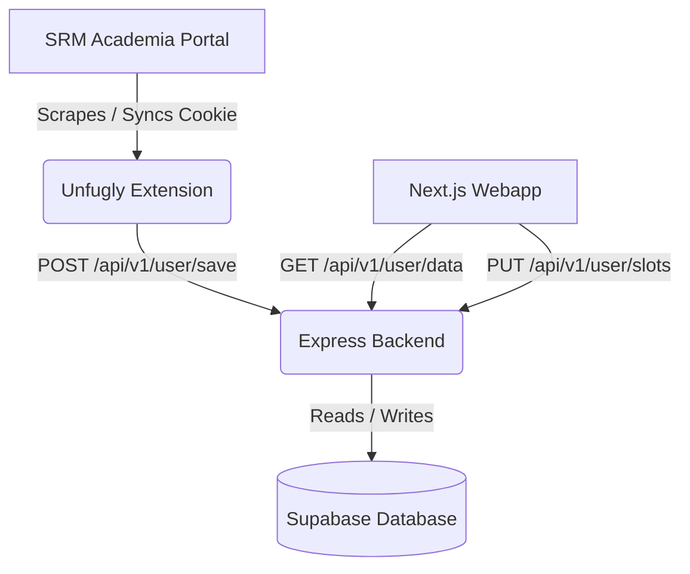

# Unfugly Ecosystem

**Radically simplifying the SRM Academia portal experience with a beautiful, fast, and feature-rich unified platform.**

The Unfugly ecosystem is split into three primary components that work in tandem to capture, process, and display academic information for SRM students:

1.  **[Chrome Extension](file:///c:/Users/DELL/Cooking/Unfugly/extension)**: Injects directly into the SRM Academia page to redesign the interface, capture data, fast-track faculty feedback, and sync details to the cloud.
2.  **[Next.js Webapp](file:///c:/Users/DELL/Cooking/Unfugly/webapp)**: A premium, dark-mode dashboard providing cross-device access to timetables, attendance analytics, internal marks, and calendars.
3.  **[Express Backend (unfugly-backend)](file:///c:/Users/DELL/Cooking/Unfugly/unfugly-backend)**: A secure Node.js/Express API that manages cookie state propagation, captcha solving, background scraping, and Supabase database interactions.

---

## 🛠️ Architecture Overview



## 📂 Project Structure

```
Unfugly/
├── extension/          # Chrome extension source files (JS, CSS, assets)
├── webapp/             # Next.js webapp frontend
├── unfugly-backend/    # Express API backend & Puppeteer scraper
├── flow.md             # Detailed data sync guidelines
└── README.md           # This file
```

---

## 🚀 Setup & Development

Refer to the service-specific documentation to get started with individual components:

*   📖 **[Extension Setup](file:///c:/Users/DELL/Cooking/Unfugly/extension/README.md)**
*   📖 **[Webapp Setup](file:///c:/Users/DELL/Cooking/Unfugly/webapp/README.md)**
*   📖 **[Backend Setup](file:///c:/Users/DELL/Cooking/Unfugly/unfugly-backend/README.md)**

## 🛡️ Workspace Rules
AI agents working in this repository must follow the instructions configured in **[.agents/AGENTS.md](file:///c:/Users/DELL/Cooking/Unfugly/.agents/AGENTS.md)**.